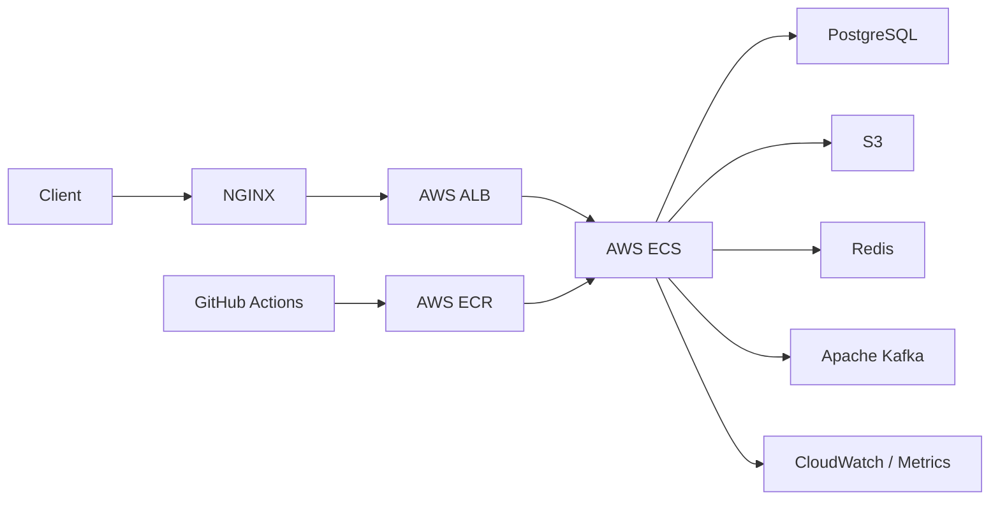

# 모두의 플리 서버


## 프로젝트 소개

모두의 플리는 영화, 드라마, 스포츠 등 다양한 콘텐츠를 함께 탐색하고, 개인 플레이리스트와 실시간 시청 경험을 제공하는 콘텐츠 큐레이션 서비스 백엔드입니다.

사용자는 콘텐츠를 평가하거나 플레이리스트로 관리할 수 있고, 다른 사용자와 팔로우, DM, 실시간 채팅, 알림을 통해 상호작용할 수 있습니다.

## 서비스

- 헬스 체크: `/actuator/health`
- Swagger UI: `/swagger-ui/index.html`
- API Docs: `/v3/api-docs`
- WebSocket STOMP: `/ws`

## 주요 기능

| 구분 | 내용 |
| --- | --- |
| 사용자 | 회원가입, 로그인, JWT 인증/인가, 어드민 계정 초기화, 권한 관리, 계정 잠금 |
| 콘텐츠 | 콘텐츠 등록, 수정, 삭제, 조회, TMDB 및 The Sports DB 연동 수집 |
| 큐레이션 | 콘텐츠 평가, 개인 플레이리스트, 플레이리스트 구독 |
| 프로필 | 프로필 조회/수정, 팔로우, 현재 시청 중 콘텐츠 조회 |
| 실시간 | WebSocket 기반 시청 세션, 콘텐츠 채팅, DM 실시간 송수신 |
| 알림 | SSE 기반 알림 전송, 알림 조회 및 읽음 처리 |
| 운영 | Actuator 헬스 체크, Prometheus 메트릭, GitHub Actions 기반 검증 |

## 기술 스택

| 구분 | 기술 |
| --- | --- |
| Backend & Application | Java 17, Spring Boot 3.5.x, Spring Batch, RestClient, Actuator, MapStruct, QueryDSL |
| Data & Messaging | PostgreSQL, Spring Data JPA, Spring Data JDBC, Redis, Apache Kafka |
| Infrastructure & DevOps | AWS ECS, ALB, S3, ECR, Docker, GitHub Actions, NGINX |
| API Documentation & Testing | Swagger, OpenAPI, JUnit5, Mockito, Jacoco, WireMock, Testcontainers |

## 아키텍처



## 프로젝트 구조

```text
src/main/java/io/mopl
├── global      # 공통 설정, 보안, 예외, 응답, 검증, 이벤트, 캐시, 실시간 통신
├── infra       # Redis, Kafka, S3, 외부 API 등 인프라 연동
└── domain      # 사용자, 콘텐츠, 알림, 실시간 기능 등 도메인 영역
```

현재 공통 설정과 전역 예외 처리 기반을 먼저 구성하고 있으며, 각 도메인은 Swagger 명세와 프론트엔드 연동 계약에 맞춰 순차적으로 구현합니다.

## 실시간 채널

- 시청 세션 입장 발행: `/pub/contents/{contentId}/watching-sessions/enter`
- 시청 세션 퇴장 발행: `/pub/contents/{contentId}/watching-sessions/leave`
- 시청 세션 이벤트 구독: `/sub/contents/{contentId}/watching-sessions`

## 실행

```bash
chmod +x gradlew
./gradlew bootRun
```

## 로컬 환경 Docker 기반 Redis 컨테이너 실행
```bash
   docker-compose -f docker-compose-redis.yml up -d
````
기본 개발 프로필은 `dev`이며, 로컬 개발 환경에서는 H2 기반 설정을 사용합니다.

## 테스트

```bash
chmod +x gradlew
./gradlew test
```

테스트는 `test` 프로필로 실행하며, `src/test/resources/application-test.yml`에 정의한
인메모리 H2 데이터베이스를 사용합니다.


## 문서

- API 명세는 Swagger 문서를 기준으로 관리합니다.
- 구현 시 엔드포인트, 요청/응답 DTO, 커서 페이지네이션 형식은 Swagger와 정합성을 맞춥니다.
