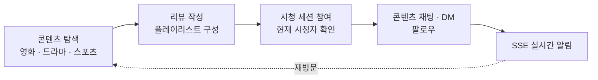
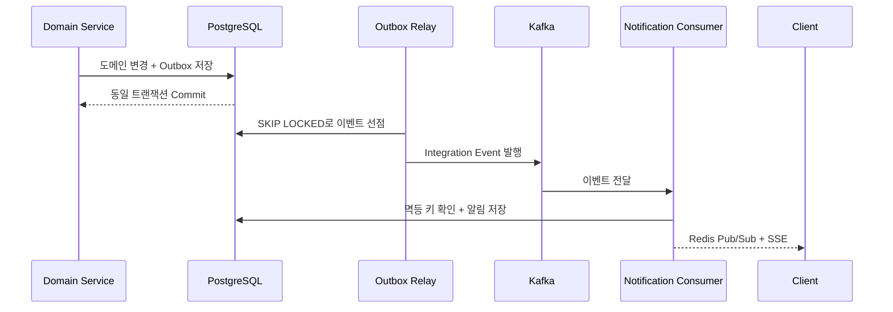
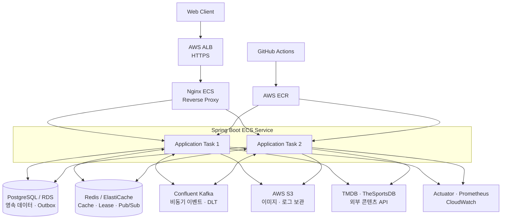
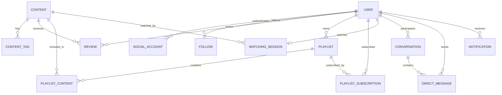
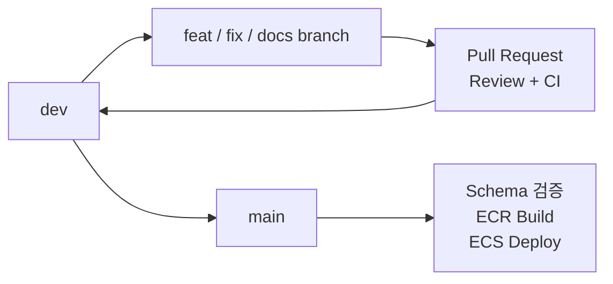

# 모두의 플리 (MOPL)

> 흩어진 영화·드라마·스포츠 콘텐츠를 한곳에서 탐색하고,
> 플레이리스트와 실시간 상호작용으로 취향과 시청 경험을 연결하는 콘텐츠 플랫폼


## 목차

- [프로젝트 소개](#프로젝트-소개)
- [핵심 사용자 경험](#핵심-사용자-경험)
- [주요 기능](#주요-기능)
- [핵심 기술 설계](#핵심-기술-설계)
- [시스템 아키텍처](#시스템-아키텍처)
- [도메인 구조](#도메인-구조)
- [기술 스택](#기술-스택)
- [품질 관리와 협업](#품질-관리와-협업)
- [로컬 실행](#로컬-실행)

## 프로젝트 소개

콘텐츠 서비스는 작품을 찾는 경험과 시청 후 감상을 나누는 경험이 서로 분리되어 있습니다.
모두의 플리는 여러 외부 콘텐츠를 통합해 탐색하고, 사용자가 만든 플레이리스트를 중심으로 다른 사용자와 관계를 맺으며, 같은 콘텐츠를 보는 순간까지 연결하는 것을 목표로 합니다.

| 항목 | 내용                                                      |
| --- |---------------------------------------------------------|
| 프로젝트 형태 | 5인 백엔드 팀 프로젝트                                           |
| 개발 기간 | 2026.06 ~ 2026.07                                       |
| 개발 방식 | `dev` 통합 브랜치 기반 기능 브랜치·Pull Request·코드 리뷰               |
| API 계약 | Swagger/OpenAPI 우선                                      |
| 운영 환경 | AWS ALB → Nginx ECS → Spring Boot ECS → RDS·ElastiCache |

서비스 확장성과 안정적인 사용자 경험을 위해 다음 기술 목표를 두었습니다.

- 여러 서버 인스턴스 간 시청 상태와 실시간 메시지의 일관된 전달
- 도메인 트랜잭션과 비동기 알림 이벤트 사이의 유실·중복 방지
- 데이터 증가에도 안정적인 검색 및 커서 페이지네이션 성능 확보
- 외부 API와 메시지 브로커 장애가 핵심 사용자 요청으로 전파되지 않는 격리 구조

## 핵심 사용자 경험


```mermaid
flowchart LR
    Explore["콘텐츠 탐색<br/>영화 · 드라마 · 스포츠"]
    Curate["리뷰 작성<br/>플레이리스트 구성"]
    Watch["시청 세션 참여<br/>현재 시청자 확인"]
    Interact["콘텐츠 채팅 · DM<br/>팔로우"]
    Notify["SSE 실시간 알림"]

    Explore --> Curate --> Watch --> Interact --> Notify
    Notify -. 재방문 .-> Explore
```

1. TMDB와 TheSportsDB에서 수집한 콘텐츠를 검색하고 상세 정보를 확인합니다.
2. 리뷰를 남기거나 나만의 플레이리스트를 만들고 다른 사용자의 플레이리스트를 구독합니다.
3. 콘텐츠 시청 세션에 참여해 현재 함께 시청 중인 사용자를 확인합니다.
4. 시청 참여자끼리 콘텐츠 채팅을 나누고, 사용자 간에는 영속적인 DM을 주고받습니다.
5. 팔로우·플레이리스트·DM 등 주요 활동을 실시간 알림으로 전달받습니다.

## 주요 기능

| 영역 | 기능 | 구현 포인트 |
| --- | --- | --- |
| 인증·사용자 | JWT 로그인, Google·Kakao OAuth2, 권한·잠금 관리, 프로필 | Spring Security, CSRF 방어, Redis 토큰 관리 |
| 콘텐츠 | 영화·드라마·스포츠 수집, 검색·필터·정렬, 관리자 CRUD | TMDB·TheSportsDB, QueryDSL, PostgreSQL `pg_trgm` |
| 큐레이션 | 리뷰, 플레이리스트, 콘텐츠 추가, 구독 | 커서 페이지네이션, 도메인 이벤트 |
| 소셜 | 팔로우, 사용자 검색, 현재 시청 정보 | Redis Cache, OpenSearch 장애 시 DB fallback |
| 실시간 시청 | 입장·퇴장, 현재 시청자, 콘텐츠 채팅 | WebSocket/STOMP, Redis lease·Pub/Sub |
| 다이렉트 메시지 | 대화방, 메시지 내역, 읽음 처리, 실시간 수신 | PostgreSQL 영속화, WebSocket, 참여자 인가 |
| 알림 | 목록·읽음 처리, 실시간 전달, 비동기 생성 | SSE, Kafka, Transactional Outbox, DLT |
| 운영 | 헬스 체크, 메트릭, 로그 보관, 자동 배포 | Actuator, Prometheus, Spring Batch, AWS ECS |

## 핵심 기술 설계

### 1. 다중 인스턴스 실시간 상태 동기화

ECS Task마다 WebSocket 연결과 JVM 메모리가 분리되므로 로컬 상태만으로는 다른 Task에 접속한 사용자에게 이벤트를 전달할 수 없습니다.

- PostgreSQL을 최종 시청 상태와 DM의 영속 저장소로 사용했습니다.
- Redis Set과 lease로 콘텐츠별 현재 시청자 및 Task별 구독 상태를 공유했습니다.
- Redis Pub/Sub으로 시청 상태, 콘텐츠 채팅, DM, SSE 알림을 모든 Task에 중계했습니다.
- DM은 대화방 STOMP 전송과 함께 수신자 SSE `direct-messages` 이벤트를 발행해 기존 대화 목록을 갱신합니다.
- SSE 연결 시 해당 연결에만 최신 미읽음 알림 20건을 시간순으로 다시 보내 연결 단절 직후의 화면 복구를 보조합니다.
- 비정상 종료 시 만료 lease를 정리하고 DB 상태를 멱등하게 복구하도록 설계했습니다.
- STOMP 구독 시 시청 참여자와 대화 참여자를 검증해 destination 탈취를 차단했습니다.

Redis Pub/Sub은 실시간 전달 경로일 뿐 영속 기록으로 사용하지 않습니다. SSE 연결 시 최신 알림을 보조적으로 다시 보내지만 전체 이력 복구를 보장하지 않으며, 재접속 후 완전한 복구가 필요한 데이터는 PostgreSQL 조회 API를 기준으로 합니다.

### 2. 알림 이벤트의 유실과 중복 방지

도메인 변경과 Kafka 발행을 한 트랜잭션으로 묶을 수 없는 문제를 Transactional Outbox로 해결했습니다.


```mermaid
sequenceDiagram
    participant Domain as Domain Service
    participant DB as PostgreSQL
    participant Relay as Outbox Relay
    participant Kafka
    participant Consumer as Notification Consumer
    participant Client

    Domain->>DB: 도메인 변경 + Outbox 저장
    DB-->>Domain: 동일 트랜잭션 Commit
    Relay->>DB: SKIP LOCKED로 이벤트 선점
    Relay->>Kafka: Integration Event 발행
    Kafka->>Consumer: 이벤트 전달
    Consumer->>DB: 멱등 키 확인 + 알림 저장
    Consumer-->>Client: Redis Pub/Sub + SSE
```

- PostgreSQL `FOR UPDATE SKIP LOCKED`로 여러 Relay가 같은 이벤트를 처리하지 않도록 했습니다.
- broker ACK 이후에만 Outbox를 완료 처리하고, 실패 시 지수 백오프로 재시도합니다.
- 결정적 `deduplication_key`와 `processed_kafka_events` 유니크 제약으로 중복을 방어합니다.
- 영구 오류는 DLT로 격리하고, 일시 오류만 제한적으로 재시도합니다.
- JSON Schema 호환성을 배포 전에 검증하며 런타임 자동 등록은 비활성화했습니다.

### 3. 콘텐츠 100,000건 조회 성능 개선

재현 가능한 부하 환경에서 병목을 측정하고, 효과가 확인된 변경만 운영 코드에 반영했습니다.

| 시나리오 | 개선 전 p95 | 개선 후 p95 | 결과 |
| --- | ---: | ---: | ---: |
| 최신순 조회 | 78.169ms | 28.383ms | 63.7% 감소 |
| 3글자 검색 | 468.841ms | 27.711ms | 94.1% 감소 |
| 2글자 + 태그 검색 | 618.159ms | 97.468ms | 84.2% 감소 |
| 깊은 생성일 커서 DB 실행 | 21.467ms | 0.074ms | 99% 이상 감소 |

- 3글자 이상 부분 검색에 PostgreSQL `pg_trgm` GIN 인덱스를 적용했습니다.
- 짧은 검색어는 정확한 검색 의미를 유지하는 별도 안전 경로로 분리했습니다.
- 복합 인덱스 순서와 같은 행 값 비교를 사용해 깊은 커서의 인덱스 탐색을 유도했습니다.
- 불필요한 `DISTINCT`와 `COUNT(DISTINCT ...)`를 제거했습니다.
- OpenSearch 도입이나 광범위한 결과 캐시는 운영 복잡도와 무효화 비용을 측정한 뒤 적용 범위에서 제외했습니다.

측정 환경과 재현 방법은 [콘텐츠 조회 성능 최적화 보고서](performance/content-query/final-report.md)에서 확인할 수 있습니다.

### 4. 운영 장애를 고려한 경계 설계

| 장애 지점 | 대응 |
| --- | --- |
| 외부 콘텐츠 API | timeout·재시도 정책과 provider별 실패 격리 |
| OpenSearch | 검색 실패 시 PostgreSQL 조회 경로로 fallback |
| Kafka | HTTP readiness에서 분리하고 Outbox 재시도로 복구 |
| Redis 실시간 중계 | 영속 데이터는 PostgreSQL에서 재조회 |
| ECS Task 종료 | Redis lease 만료 감지와 멱등 DB 정리 |
| 배포 | 새 Task Definition과 ECR image 반영 후 service stability 확인 |

## 시스템 아키텍처


```mermaid
flowchart TB
    Client["Web Client"]
    ALB["AWS ALB<br/>HTTPS"]
    Nginx["Nginx ECS<br/>Reverse Proxy"]

    subgraph App["Spring Boot ECS Service"]
        App1["Application Task 1"]
        App2["Application Task 2"]
    end

    RDS[("PostgreSQL / RDS<br/>영속 데이터 · Outbox")]
    Redis[("Redis / ElastiCache<br/>Cache · Lease · Pub/Sub")]
    Kafka["Confluent Kafka<br/>비동기 이벤트 · DLT"]
    S3["AWS S3<br/>이미지 · 로그 보관"]
    External["TMDB · TheSportsDB<br/>외부 콘텐츠 API"]
    Metrics["Actuator · Prometheus<br/>CloudWatch"]
    Actions["GitHub Actions"]
    ECR["AWS ECR"]

    Client --> ALB --> Nginx
    Nginx --> App1
    Nginx --> App2
    App1 --> RDS
    App2 --> RDS
    App1 <--> Redis
    App2 <--> Redis
    App1 <--> Kafka
    App2 <--> Kafka
    App1 --> S3
    App2 --> S3
    App1 --> External
    App2 --> External
    App1 --> Metrics
    App2 --> Metrics
    Actions --> ECR
    ECR --> App1
    ECR --> App2
```

### 데이터 저장소의 역할

| 저장소 | 책임 | 선택 이유 |
| --- | --- | --- |
| PostgreSQL | 사용자·콘텐츠·리뷰·메시지·알림·Outbox | 트랜잭션과 영속 데이터의 단일 기준 |
| Redis | Cache, 토큰, 시청 lease·presence, 실시간 Pub/Sub | 짧은 수명의 공유 상태와 빠른 fan-out |
| Kafka | 도메인 간 비동기 알림 이벤트, DLT | 생산자·소비자 분리와 실패 복구 |
| OpenSearch | 사용자 검색 | 검색 확장성 확보, 장애 시 DB fallback |
| S3 | 프로필 이미지와 로그 아카이브 | 애플리케이션 파일 시스템과 수명 분리 |

## 도메인 구조


```mermaid
erDiagram
    USER ||--o{ SOCIAL_ACCOUNT : authenticates
    USER ||--o{ FOLLOW : follows
    USER ||--o{ REVIEW : writes
    USER ||--o{ PLAYLIST : owns
    USER ||--o{ PLAYLIST_SUBSCRIPTION : subscribes
    USER ||--o| WATCHING_SESSION : watches
    USER ||--o{ CONVERSATION : participates
    USER ||--o{ DIRECT_MESSAGE : sends
    USER ||--o{ NOTIFICATION : receives

    CONTENT ||--o{ CONTENT_TAG : has
    CONTENT ||--o{ REVIEW : receives
    CONTENT ||--o{ PLAYLIST_CONTENT : included_in
    CONTENT ||--o{ WATCHING_SESSION : watched_by

    PLAYLIST ||--o{ PLAYLIST_CONTENT : contains
    PLAYLIST ||--o{ PLAYLIST_SUBSCRIPTION : subscribed_by
    CONVERSATION ||--o{ DIRECT_MESSAGE : contains
```

실제 운영 스키마는 Flyway 마이그레이션을 기준으로 관리하며, JPA의 `ddl-auto`는 운영 환경에서 사용하지 않습니다.

## 기술 스택

| 구분 | 기술 |
| --- | --- |
| Backend | Java 17, Spring Boot 3.5, Spring Security, Spring Batch |
| Persistence | PostgreSQL, Spring Data JPA, QueryDSL, Flyway |
| Search & Cache | OpenSearch, Redis, Spring Cache |
| Messaging & Realtime | Kafka, Confluent Schema Registry, WebSocket/STOMP, SSE |
| External & Storage | Spring RestClient, TMDB, TheSportsDB, AWS S3 |
| Infrastructure | Docker, AWS ECS·ALB·RDS·ECR, Nginx, Secrets Manager |
| Test & Quality | JUnit 5, Mockito, Testcontainers, Embedded Kafka, JaCoCo |
| CI/CD & Observability | GitHub Actions, Actuator, Prometheus, CloudWatch |

## 품질 관리와 협업

### 자동 검증

- PR과 `dev`·`main` 반영 시 테스트와 JaCoCo 검증을 GitHub Actions에서 실행합니다.
- DTO·Entity·Exception·Mapper를 제외한 비즈니스 코드의 라인 커버리지 80%를 품질 게이트로 적용합니다.
- PostgreSQL 동시성 쿼리, Kafka 소비·DLT, Redis Pub/Sub, WebSocket 인가를 변경 범위에 맞는 통합·단위 테스트로 검증합니다.
- API 계약은 Swagger/OpenAPI를 기준으로 관리하고, DB 변경은 기존 migration을 수정하지 않고 새 Flyway version으로 추가합니다.

```bash
./gradlew check --no-daemon
```

### 브랜치와 배포 흐름


```mermaid
flowchart LR
    Dev["dev"]
    Work["feat / fix / docs branch"]
    PR["Pull Request<br/>Review + CI"]
    Main["main"]
    Deploy["Schema 검증<br/>ECR Build<br/>ECS Deploy"]

    Dev --> Work --> PR --> Dev
    Dev --> Main --> Deploy
```

- `main`은 배포, `dev`는 통합 브랜치로 분리하고 모든 변경은 작업 브랜치와 PR을 거칩니다.
- 공통 설정과 도메인 구현을 분리해 변경 범위가 독립적으로 검토되도록 관리합니다.
- 운영 배포는 GitHub Actions 성공뿐 아니라 ECS revision, image, rollout 상태까지 확인합니다.

## 프로젝트 구조

```text
src/main/java/io/mopl
├── domain
│   ├── auth, user, follow
│   ├── content, review, playlist
│   ├── watchingsession, contentroomchat
│   └── directmessage, notification
├── global
│   ├── config, security, exception
│   ├── event, websocket, sse
│   └── cache, scheduler, logging
└── infra
    ├── external, storage
    ├── redis, kafka
    └── outbox
```

도메인은 자신의 유스케이스와 이벤트 의미를 소유하고, Redis·Kafka·S3 같은 기술 구현은 포트 또는 `infra` 경계 뒤에 배치했습니다.

## 로컬 실행

### 요구 사항

- JDK 17
- Docker
- Redis 7

### 빠른 실행: H2 + Redis

```bash
export LOCAL_REDIS_PASSWORD="<local-only-password>"
export LOCAL_JWT_SECRET="$(openssl rand -base64 32)"
docker compose -f docker-compose/docker-compose-redis.yml up -d

SPRING_PROFILES_ACTIVE=local-h2 \
./gradlew bootRun
```

실행 환경은 `SPRING_PROFILES_ACTIVE`로 명시합니다. 빠른 기능 확인에는 `local-h2`를, PostgreSQL 전용 쿼리와 Flyway 검증에는 `dev` 프로필을 사용합니다.

### API와 운영 엔드포인트

| 용도 | 경로 |
| --- | --- |
| Swagger UI | `/swagger-ui/index.html` |
| OpenAPI JSON | `/v3/api-docs` |
| WebSocket/STOMP | `/ws` |
| SSE 알림 | `/api/sse` |
| Health Check | `/actuator/health` |
| Prometheus | `/actuator/prometheus` |

<details>
<summary>로컬 OpenSearch 실행</summary>

```bash
docker compose -f docker-compose/docker-compose-opensearch.yml up -d
```

- OpenSearch: `http://localhost:9200`
- OpenSearch Dashboards: `http://localhost:5601`

</details>

<details>
<summary>프로필별 데이터베이스와 migration 정책</summary>

| 프로필 | 데이터베이스 | Flyway | 용도 |
| --- | --- | --- | --- |
| `local-h2` | H2 PostgreSQL mode | 비활성 | 빠른 로컬 기능 확인 |
| `test` | H2 | 비활성 | 자동 테스트 |
| `dev` | PostgreSQL | 활성 | 개발·migration 검증 |
| `prod` | PostgreSQL RDS | 활성 | 운영 |

운영 비밀값은 AWS Secrets Manager에서 주입하며 저장소에 커밋하지 않습니다.

</details>

## 참고 문서

- [콘텐츠 조회 100,000건 성능 최적화](performance/content-query/final-report.md)
- [성능 테스트 재현 방법](performance/content-query/README.md)
- [Pull Request 작성 기준](.github/PULL_REQUEST_TEMPLATE.md)
