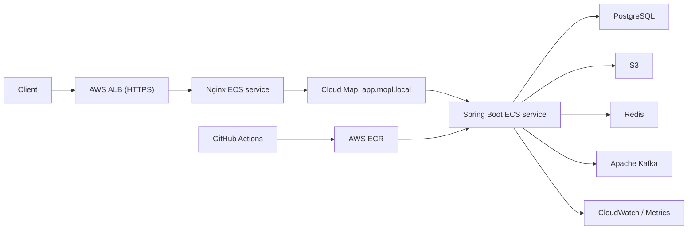

# 모두의 플리 서버


## 프로젝트 소개

모두의 플리는 영화, 드라마, 스포츠 등 다양한 콘텐츠를 함께 탐색하고, 개인 플레이리스트와 실시간 시청 경험을 제공하는 콘텐츠 큐레이션 서비스 백엔드입니다.

사용자는 콘텐츠를 평가하거나 플레이리스트로 관리할 수 있고, 다른 사용자와 팔로우, DM, 실시간 채팅, 알림을 통해 상호작용할 수 있습니다.

## 서비스

- 헬스 체크: `/actuator/health`
- Swagger UI: `/swagger-ui/index.html`
- API Docs: `/v3/api-docs`
- WebSocket STOMP: `/ws`

## 주요 기능

| 구분 | 내용 |
| --- | --- |
| 사용자 | 회원가입, 로그인, JWT 인증/인가, 어드민 계정 초기화, 권한 관리, 계정 잠금 |
| 콘텐츠 | 콘텐츠 등록, 수정, 삭제, 조회, TMDB 및 The Sports DB 연동 수집 |
| 큐레이션 | 콘텐츠 평가, 개인 플레이리스트, 플레이리스트 구독 |
| 프로필 | 프로필 조회/수정, 팔로우, 현재 시청 중 콘텐츠 조회 |
| 실시간 | WebSocket 기반 시청 세션, 콘텐츠 채팅, DM 실시간 송수신 |
| 알림 | SSE 기반 알림 전송, 알림 조회 및 읽음 처리 |
| 운영 | Actuator 헬스 체크, Prometheus 메트릭, GitHub Actions 기반 검증 |

## 기술 스택

| 구분 | 기술 |
| --- | --- |
| Backend & Application | Java 17, Spring Boot 3.5.x, Spring Batch, RestClient, Actuator, MapStruct, QueryDSL |
| Data & Messaging | PostgreSQL, Spring Data JPA, Spring Data JDBC, Redis, Apache Kafka |
| Infrastructure & DevOps | AWS ECS, ALB, S3, ECR, Docker, GitHub Actions, NGINX |
| API Documentation & Testing | Swagger, OpenAPI, JUnit5, Mockito, Jacoco, WireMock, Testcontainers |

## 아키텍처


```mermaid
flowchart LR
    Client["Client"] --> ALB["AWS ALB (HTTPS)"]
    ALB --> NGINX["Nginx ECS service"]
    NGINX --> CloudMap["Cloud Map: app.mopl.local"]
    CloudMap --> ECS["Spring Boot ECS service"]
    ECS --> RDS["PostgreSQL"]
    ECS --> S3["S3"]
    ECS --> Redis["Redis"]
    ECS --> Kafka["Apache Kafka"]
    ECS --> CloudWatch["CloudWatch / Metrics"]
    Github["GitHub Actions"] --> ECR["AWS ECR"]
    ECR --> ECS
```

## 운영 확장 메모

- ECS는 ALB → Nginx 서비스 → Cloud Map(`app.mopl.local`) → Spring Boot 서비스 순서로 요청을 전달합니다. ALB target group은 Nginx의 `/nginx-health`를, 운영 점검은 Spring Boot의 `/actuator/health/liveness`와 `/actuator/health/readiness`를 사용합니다.
- prod 프로필은 `server.forward-headers-strategy=framework`로 ALB·Nginx가 전달한 `X-Forwarded-*` 헤더를 Spring MVC 요청과 리다이렉트 URL에 반영합니다. Spring Boot Task의 security group은 Nginx Task security group만 인바운드 8080을 허용해야 하며, 클라이언트가 `X-Forwarded-*` 헤더를 직접 주입할 수 없어야 합니다.
- Nginx는 `/api/sse`에서 buffering을 끄고, `/ws`의 WebSocket/SockJS Upgrade를 전달합니다. Nginx와 Spring Boot 서비스는 모두 최소 2개 Task로 운영해야 단일 Task 장애에 대응할 수 있습니다.
- `application-prod.yml`은 AWS Secrets Manager `mopl-prod-secrets`에서 DB 및 Confluent Cloud 연결 정보를 읽습니다. Kafka·Schema Registry API key와 secret은 Git이나 Task Definition에 넣지 않습니다.

## ECS 이미지 빌드 및 배포

GitHub Actions의 prod 배포는 `main` 병합 시에만 실행됩니다. 로컬에서 ECR 이미지를 검증·업로드해야 하는 경우 Fargate의 기본 x86_64 런타임과 맞도록 `linux/amd64` 플랫폼을 명시합니다.

```bash
docker buildx build --platform linux/amd64 --load -t "$ECR_APP_URI:$IMAGE_TAG" .
docker push "$ECR_APP_URI:$IMAGE_TAG"

docker buildx build --platform linux/amd64 --load -t "$ECR_NGINX_URI:$IMAGE_TAG" ./nginx
docker push "$ECR_NGINX_URI:$IMAGE_TAG"
```

ECS 서비스에 반영된 Task Definition revision과 ECR image digest를 함께 확인합니다. 소스의 이미지 태그만 바뀌고 서비스가 새 revision을 채택하지 않은 상태는 배포 완료가 아닙니다.

- WatchingSession의 최종 시청 세션은 PostgreSQL에 보관하고, Redis 활성화 환경에서는 콘텐츠별 현재 시청자 상태를 ElastiCache Set으로 공유합니다.
- `WATCHING_SESSION_REDIS_ENABLED=true`이면 ECS Task별 시청 구독을 Redis lease로 관리합니다. 동일 사용자가 여러 Task 또는 여러 탭에서 구독하더라도 전역 최초 구독에서만 JOIN, 전역 마지막 구독 해제에서만 LEAVE를 발생시킵니다. Task 비정상 종료는 lease 만료 후 정리합니다.
- 입장·퇴장 변경 이벤트는 Redis Pub/Sub으로 중계하여, 어느 ECS Task에 연결된 클라이언트라도 동일한 WebSocket 변경 이벤트를 받습니다. Pub/Sub은 휘발성 UI 동기화 경로이며, Kafka 기반 영속 이벤트 처리는 별도 후속 작업으로 관리합니다.
- WebSocket STOMP 연결은 JWT 인증이 필요합니다. `/sub/contents/{contentId}/watch`는 인증 사용자를, `/sub/contents/{contentId}/chat`은 해당 콘텐츠의 현재 WatchingSession 참여자를, `/sub/conversations/{conversationId}/direct-messages`는 대화 참여자만 구독할 수 있습니다.
- `WATCHING_SESSION_REDIS_PRESENCE_TTL`, `WATCHING_SESSION_REDIS_LEASE_TTL`, `WATCHING_SESSION_REDIS_LEASE_MAINTENANCE_DELAY_MILLIS`로 만료 정책을 조정할 수 있습니다. ElastiCache 운영 환경에서는 `REDIS_SSL_ENABLED=true`와 별도 `REDIS_PASSWORD`를 사용합니다. 로컬·테스트 기본값은 Redis 기능 비활성화 상태입니다.
- 실시간 시청자 수는 현재 DB count 기준으로 계산합니다. 고동시성 구간에서만 Redis Set cardinality 또는 별도 counter로 조회 경로를 분리합니다.

## Kafka 및 스키마 마이그레이션 기반

- Flyway는 `dev`·`prod` 프로필에서 활성화되어 `src/main/resources/db/migration`의 SQL을 PostgreSQL 시작 시 적용합니다. 공통 설정의 `FLYWAY_ENABLED` 기본값은 `false`이며, `test` 프로필은 Flyway를 비활성화합니다.
- 도메인 서비스는 `IntegrationEventPublisher` 포트로 이벤트를 `event_outbox`에 같은 트랜잭션으로 저장합니다. Kafka 알림 모드는 원본 도메인 이벤트를 `BEFORE_COMMIT`에 처리하고 `REQUIRED` 전파로 Outbox를 적재하므로, 원본 트랜잭션 롤백 시 Outbox도 함께 롤백됩니다. LOCAL 모드는 기존 `AFTER_COMMIT` 즉시 알림 생성 흐름을 유지합니다. 다중 Relay는 PostgreSQL `FOR UPDATE SKIP LOCKED`로 이미 선점된 이벤트를 건너뛰고, Kafka broker ACK 이후에만 발행 완료로 변경합니다.
- Kafka와 Outbox Relay는 기본값 `KAFKA_ENABLED=false`로 비활성화됩니다. ECS prod Task는 `KAFKA_ENABLED=true`, `NOTIFICATION_DELIVERY_MODE=kafka`로 활성화합니다. 런타임은 Schema Registry에 자동 등록하지 않으며, main 배포 워크플로가 `notification-value`와 `notification-dlt-value` subject의 BACKWARD 호환성을 확인하고 스키마를 등록한 뒤 배포합니다. 발행 실패는 지수 백오프로 재시도하고 선점 만료 이벤트는 복구합니다.
- 알림 전달 모드는 기본 `local`이며, `NOTIFICATION_DELIVERY_MODE=kafka`에서 `NotificationRequestedEvent`를 Outbox로 적재하고 `notification` consumer가 처리합니다. Outbox는 `sourceEventId:receiverId` 결정적 `deduplication_key`의 유니크 제약으로 중복 적재를 방지하고, `processed_kafka_events.event_key`의 유니크 제약으로 envelope `eventId` 중복 수신은 무시합니다.
- 알림 consumer는 `ErrorHandlingDeserializer`로 Schema Registry 조회 실패, 잘못된 JSON Schema payload, 바이너리 역직렬화 실패를 listener poll 단계에서 격리합니다. 역직렬화 실패 원본 `byte[]`는 전용 serializer로, 정상 JSON Schema 객체는 기본 serializer로 `notification-dlt`에 보존합니다.
- 알 수 없는 `eventType`·지원하지 않는 `eventVersion`·필수 payload 누락 같은 영구 오류는 즉시 `notification-dlt`로 이동합니다. DB·네트워크 등 일시 오류만 blocking backoff로 재시도하며, DLT는 원인 수정 후 새 consumer group 또는 명시적 offset 관리로 재처리합니다. 원인을 고치지 않은 채 원본 topic에 재발행하지 않습니다.
- DLT topic의 partition 수는 원본 `notification` topic 이상이어야 합니다. Recoverer가 원본 partition 번호로 DLT에 발행하므로 이 조건을 만족하지 않으면 DLT 발행 자체가 실패할 수 있습니다.
- SSE 알림 실시간 발송은 기본적으로 현재 Task의 연결에 직접 전송합니다. `NOTIFICATION_REALTIME_REDIS_ENABLED=true`이면 생성 이벤트를 Redis Pub/Sub 채널에 발행하고, 모든 ECS Task가 수신 후 각 Task가 보유한 해당 수신자의 SSE 연결에 전달합니다. Redis Pub/Sub은 휘발성 UI 전달 경로이므로 영속적 재전송이 필요한 알림 조회는 기존 DB API를 기준으로 합니다.

| 환경 변수 | 기본값 | 용도 |
| --- | --- | --- |
| `KAFKA_ENABLED` | `false` | Kafka producer, listener, health check 및 Outbox Relay 활성화 여부 |
| `KAFKA_BOOTSTRAP_SERVERS` | `localhost:9092` | Kafka broker 주소 목록 |
| `KAFKA_SCHEMA_REGISTRY_URL` | `http://localhost:8081` | Confluent Schema Registry 주소 |
| `KAFKA_API_KEY` | 없음 | Confluent Kafka runtime 서비스 계정 API key (prod secret) |
| `KAFKA_API_SECRET` | 없음 | Confluent Kafka runtime 서비스 계정 API secret (prod secret) |
| `KAFKA_SCHEMA_REGISTRY_API_KEY` | 없음 | ECS runtime 및 CI schema 등록·호환성 검사 공용 API key (`mopl-prod-secrets`) |
| `KAFKA_SCHEMA_REGISTRY_API_SECRET` | 없음 | ECS runtime 및 CI schema 등록·호환성 검사 공용 API secret (`mopl-prod-secrets`) |
| `NOTIFICATION_DELIVERY_MODE` | `local` | `local` 즉시 처리 또는 `kafka` Outbox·Consumer 처리 선택 |
| `NOTIFICATION_REALTIME_REDIS_ENABLED` | `false` | 다중 인스턴스 SSE 알림 Redis Pub/Sub 중계 활성화 여부 |
| `NOTIFICATION_REALTIME_REDIS_CHANNEL` | `notification:realtime` | SSE 알림 Redis Pub/Sub 채널 |
| `NOTIFICATION_KAFKA_TOPIC` | `notification` | 알림 요청 토픽 |
| `NOTIFICATION_KAFKA_DLT_TOPIC` | `notification-dlt` | 재시도 한도 초과 레코드 토픽 |
| `NOTIFICATION_KAFKA_MAX_RETRIES` | `3` | Consumer blocking 재시도 횟수 |
| `OUTBOX_RELAY_ENABLED` | `true` | Outbox Relay 및 발행 완료 데이터 정리 스케줄 활성화 여부 |
| `OUTBOX_RELAY_BATCH_SIZE` | `20` | 한 번의 Relay 실행에서 선점할 최대 이벤트 수 |
| `OUTBOX_MAX_ATTEMPTS` | `5` | Kafka 발행 최대 시도 횟수. 초과 시 `FAILED` 상태로 보관 |
| `OUTBOX_CLAIM_TIMEOUT` | `PT2M` | Relay 장애로 간주하고 선점 이벤트를 복구할 시간. 기본 `send-timeout` 5초 기준 최대 20건을 순차 발행하는 시간을 포함합니다. |
| `FLYWAY_ENABLED` | `false` | 공통 설정에서 Flyway 마이그레이션을 활성화할지 여부 (`dev`·`prod`는 별도 활성화) |

`application-prod.yml`에서만 AWS Secrets Manager import를 수행합니다. 따라서 `test`와 `local` 프로필은 외부 Secrets Manager 연결 없이 실행됩니다.
이번 변경은 내부 이벤트·Outbox 저장 경계만 다루며 Swagger 엔드포인트와 요청·응답 DTO에는 영향이 없습니다.

### Confluent Cloud 운영 적용

- Confluent Cloud에는 `notification`, `notification-dlt` topic을 만들고 DLT partition 수를 원본 이상으로 설정합니다.
- `mopl-prod-secrets` 하나에 ECS runtime 및 CI용 Confluent bootstrap/Schema Registry URL과 Kafka·Schema Registry API key를 등록합니다. ECS Task Role과 GitHub Actions 배포 IAM 사용자는 이 Secret에만 `secretsmanager:GetSecretValue` 권한이 필요하며, ECS security group은 Confluent bootstrap endpoint의 9092/TCP와 Schema Registry의 443/TCP outbound를 허용해야 합니다.
- 배포 workflow는 `notification-value`와 `notification-dlt-value` subject의 호환성을 `BACKWARD`로 설정하고 검증한 뒤 새 version을 등록합니다. ECS runtime과 CI는 동일한 Schema Registry API key를 사용하며, 런타임 자동 schema 등록은 하지 않습니다.
- 배포 뒤 새 ECS revision/ECR digest, `event_outbox`의 `PUBLISHED` 전환, `processed_kafka_events` 중복 방지, `notification-dlt` 이동을 확인합니다. consumer lag, `FAILED` Outbox 누적, DLT 증가, `Kafka publish failed` 로그를 알람 대상으로 관리합니다.
- Kafka broker 연결은 readiness probe에서 제외합니다. broker 장애가 HTTP 트래픽 전체를 비정상으로 만들지 않도록 하고, 발행 실패는 Outbox 재시도로 복구합니다. secret rotation 후에는 새 ECS deployment가 필요합니다.

## 프로젝트 구조

```text
src/main/java/io/mopl
├── global      # 공통 설정, 보안, 예외, 응답, 검증, 이벤트, 캐시, 실시간 통신
├── infra       # Redis, Kafka, S3, 외부 API 등 인프라 연동
└── domain      # 사용자, 콘텐츠, 알림, 실시간 기능 등 도메인 영역
```

현재 공통 설정과 전역 예외 처리 기반을 먼저 구성하고 있으며, 각 도메인은 Swagger 명세와 프론트엔드 연동 계약에 맞춰 순차적으로 구현합니다.

## 실행

```bash
chmod +x gradlew
./gradlew bootRun
```

## 로컬 환경 Docker 기반 Redis 컨테이너 실행
```bash
  cd docker-compose
   docker-compose -f docker-compose-redis.yml up -d
````
기본 개발 프로필은 `dev`이며, 로컬 개발 환경에서는 H2 기반 설정을 사용합니다.

## 로컬 환경 Docker 기반 OpenSearch 컨테이너 실행
```bash
  cd docker-compose
   docker-compose -f docker-compose-opensearch.yml up -d
````

## 테스트

```bash
chmod +x gradlew
./gradlew test
```

테스트는 `test` 프로필로 실행하며, `src/test/resources/application-test.yml`에 정의한
인메모리 H2 데이터베이스를 사용합니다. 테스트 프로필은 Flyway와 Kafka 자동 구성을 비활성화하므로 외부 PostgreSQL, Kafka, Schema Registry 연결이 필요하지 않습니다.
`test.ignoreFailures=false`이므로 어떤 테스트라도 실패하면 Gradle과 CI가 실패합니다. 이번 Outbox 검증에는 LOCAL 알림 회귀, 원본 트랜잭션 롤백 시 Outbox 미적재, 동일 이벤트 중복 적재 방지가 포함됩니다.


## 문서

- API 명세는 Swagger 문서를 기준으로 관리합니다.
- 구현 시 엔드포인트, 요청/응답 DTO, 커서 페이지네이션 형식은 Swagger와 정합성을 맞춥니다.
